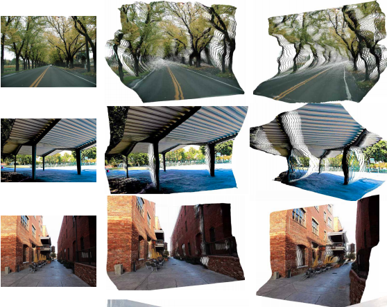

#### DiverseDepth Project
This project aims to improve the generalization ability of the monocular depth estimation method on diverse scenes. We propose a learning method and a diverse dataset, termed DiverseDepth, to solve this problem. 

This repository contains the source code of our paper (the DiverseDepth part):
1. [Wei Yin, Yfan Liu, Chunhua Shen, Virtual Normal: Enforcing Geometric Constraints for Accurate and Robust Depth Prediction](https://arxiv.org/abs/2103.04216).

## Some Results




## Some Dataset Examples


****
## Hightlights
- **Generalization:** Our method demonstrates strong generalization ability on several zero-shot datasets. The predicted depth is affine-invairiant.


****
## Installation
- Please refer to [Installation](./Installation.md).

## Datasets
We collect multi-source data to construct our DiverseDepth dataset. The It consists of three parts:
Part-in (collected from taskonomy):  contains over 100K images
Part-out (collected from DIML, we have reprocessed its disparity): contains over 120K images
Part-fore (collected from webstereo images and videos): contains 109703 images
You can download them with the following method.

```
sh download_data.sh
```


## Quick Start (Inference)

1. Download the model weights
   * [ResNeXt50 backbone](https://cloudstor.aarnet.edu.au/plus/s/ixWf3nTJFZ0YE4q)
2. Prepare data. 
   * Move the downloaded weights to  `<project_dir>/` 
   * Put the testing RGB images to `<project_dir>/Minist_Test/test_images/`. Predicted depths and reconstructed point cloud are saved under `<project_dir>/Minist_Test/test_images/outputs`

3. Test monocular depth prediction. Note that the predicted depths are affine-invariant. 
```bash
export PYTHONPATH="<PATH to DiverseDepth>"
# run the ResNet-50
python ./Minist_Test/tools/test_depth.py --load_ckpt model.pth
 
```

## Training

1. Download the ResNeXt pretrained weight and put it under `Train/datasets/resnext_pretrain`
   * [ResNeXt50](https://cloudstor.aarnet.edu.au/plus/s/J87DYsTlOjD83LR)
2. Download the training data. Refer to 'download_data.sh'. All data are organized under the `Train/datasets`. The structure of all data are as follows. 
```
|--Train
|--data
|--tools
|--scripts
|--datasets
|    |--DiverseDepth
|    |   |--annotations
|    |   |--depths
|    |   |--rgbs
|    |--taskonomy
|    |   |--annotations
|    |   |--depths
|    |   |--rgbs
|    |   |--ins_planes
|    |--DIML_GANet
|    |   |--annotations
|    |   |--depth
|    |   |--rgb
|    |   |--sky_mask
|    |--resnext_pretrain
|    |   |--resnext50_32x4d.pth
```
3. Train the network. The default setting used 4 gpus. If you want to use more gpus, please set `$CUDA_VISIBLE_DEVICES`, such as `export CUDA_VISIBLE_DEVICES=0,1,2,3,4,5,6,7`.
   The `--batchsize` is the number of samples on a single gpu. 
   ```
   cd Train/scripts
   sh train.sh
   ```

4. Test the network on a benchmark. We provide a sample code for testing on NYU. Please download the NYU testing data `test.mat` for evaluation. If you want to test on other benchmarks, you can follow the sample code.
   ```
   cd Train/scripts
   sh test.sh
   ```

### Citation
```
@article{yin2021virtual,
  title={Virtual Normal: Enforcing Geometric Constraints for Accurate and Robust Depth Prediction},
  author={Yin, Wei and Liu, Yifan and Shen, Chunhua},
  journal={IEEE Transactions on Pattern Analysis and Machine Intelligence (TPAMI)},
  year={2021}
}
@article{yin2020diversedepth,
  title={DiverseDepth: Affine-invariant Depth Prediction Using Diverse Data},
  author={Yin, Wei and Wang, Xinlong and Shen, Chunhua and Liu, Yifan and Tian, Zhi and Xu, Songcen and Sun, Changming and Renyin, Dou},
  journal={arXiv preprint arXiv:2002.00569},
  year={2020}
}
```
### Contact
Wei Yin: yvanwy@outlook.com
